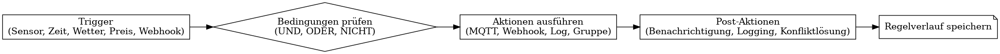

# Schritt 3 – Automatisierungsmodell & Regel-Engine: SmartEnergyHub

## 🎯 Ziel
Ein leistungsfähiges, aber einsteigerfreundliches Regelwerk zur Automatisierung von Energieverbrauch und Steuerung – ähnlich Node-RED, aber integriert, visuell und intuitiv.

---

## 🧠 Regeldefinition (Designansatz)

- Visuelle **Wenn–Dann-Logik**
- Mehrstufige Bedingungen: UND, ODER, NICHT
- Flow-Canvas wie Node-RED (für Power-User)
- Regel-Vorlagen für Einsteiger
- Test- & Simulationsmodus

---

## 🟡 Regel-Trigger (Auslöser)

| Typ             | Beschreibung                                        |
|------------------|-----------------------------------------------------|
| Sensorwert       | z. B. „PV > 3 kW“, „SOC < 30 %“                     |
| Zustandswechsel  | z. B. „PV-Leistung verändert sich“                 |
| Zeit             | z. B. „Mo–Fr um 14:00 Uhr“                         |
| Wetter           | z. B. „UV-Index > 7“                                |
| PV-Prognose      | z. B. „Morgen < 2 kWh“                              |
| Strompreis       | z. B. „< 0 ct/kWh“                                  |
| Webhook          | z. B. von IFTTT, Node-RED oder Home Assistant       |
| Manuell          | z. B. Button „Jetzt ausführen“                      |

---

## 🟢 Regel-Aktionen

| Typ               | Beschreibung                                                 |
|--------------------|--------------------------------------------------------------|
| MQTT Publish       | Geräte steuern (z. B. Shelly, Victron, Growatt, Deye)        |
| Webhook Call       | Externe Tools ansprechen (Telegram, IFTTT, APIs)             |
| Mehrfach-Aktionen  | Ketten, mit Verzögerung oder Bedingung                       |
| Status setzen      | Flags für spätere Regeln setzen                              |
| Ereignis-Logging   | Auslösungen mit Details speichern                            |
| Benachrichtigungen | Push, E-Mail, Telegram, Browser                              |
| Gruppensteuerung   | Gerätegruppen ein-/ausschalten                               |
| Konflikt-Handling  | Vorherige Regeln deaktivieren, Timer abbrechen               |

---

## ⚙️ Regelverwaltung

| Funktion              | Beschreibung                                                  |
|------------------------|---------------------------------------------------------------|
| Aktivieren/Deaktivieren | Regeln global an-/abschaltbar                                |
| Temporäres Pausieren  | z. B. „Regel für 2 Stunden aussetzen“                         |
| Debug-Modus           | Test mit Live-/Simulationsdaten                               |
| Export/Import         | Backup / Community-Sharing (JSON/YAML)                        |
| Versionierung         | Duplizieren, kommentieren, zurücksetzen                       |
| Regelverlauf          | Wann, warum, wie oft wurde die Regel ausgelöst?               |
| Gruppen & Tags        | Organisation nach Funktion, Ort, Thema                        |

---

## 🧠 Visuelle Regel-Engine (Ablauf)

---

**Bereit für Schritt 4: UI-Komponenten & Seitenstruktur**
