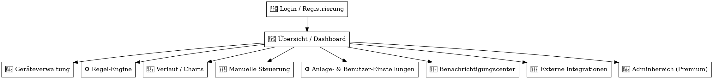

# Schritt 4–6 – UI-Struktur, Integration, Systemverhalten: SmartEnergyHub

## 🔷 Schritt 4 – UI-Komponenten & Seitenstruktur

Die Benutzeroberfläche ist responsiv, mobilfähig (PWA) und modular aufgebaut.

### Hauptbereiche:

| Bereich         | Beschreibung                                                  |
|------------------|---------------------------------------------------------------|
| 📊 Dashboard     | Übersicht über aktuelle Erzeugung, SOC, Netzstatus, etc.     |
| 🔌 Geräteverwaltung | Geräte hinzufügen, entfernen, konfigurieren                  |
| ⚙️ Regel-Engine   | Visuelle Automatisierungen mit Editor & Simulation           |
| 📈 Verlauf       | Historische Charts, Vergleich, Export                         |
| 🖲️ Steuerung     | Manuelles Schalten, Sofort-Aktionen                           |
| 🔔 Benachrichtigungen | E-Mail, Telegram, Web-Push                                 |
| ⚙️ Einstellungen | MQTT-Zugang, Standort, Profile, Limits                        |
| 🔗 Integrationen | Wetter, PV-Prognose, Strompreise, Kalender                    |
| 🛠️ Admin (Premium) | Mandantenverwaltung, Multi-User-Zugriffe                      |

---

## 🔷 Schritt 5 – Integrationen & externe Datenquellen

### Integrierte APIs & Services:

| Dienst           | Zweck                                               |
|------------------|-----------------------------------------------------|
| 🌤️ OpenWeather   | Wetterdaten (Temperatur, UV, Gewitterwarnung)       |
| 🔆 Solcast        | PV-Prognose (Tagesertrag, Sonnenstand, Einstrahlung)|
| 💡 Awattar/Tibber | Strompreise (live, Prognose, 24h Verlauf)          |
| 📅 Kalender       | Wochenlogik, z. B. „nur werktags“                   |
| 🌍 Standortdaten  | Sonnenaufgang/-untergang, Sonnenwinkel, etc.       |
| 🔁 Webhooks       | Externe Trigger & Benachrichtigungen                |

### Integrationstiefe:
- Konfigurierbar pro Installation
- Regel-Trigger fähig (z. B. „bei Gewitter → Regel pausieren“)
- Authentifizierung via Token, OAuth, API-Key

---

## 🔷 Schritt 6 – Systemverhalten & Performance

### Verhalten bei Ereignissen:

| Ereignis                  | Verhalten                                                             |
|----------------------------|----------------------------------------------------------------------|
| MQTT nicht erreichbar      | Retry-Mechanismus, Logging, Benutzerwarnung                         |
| Regel schlägt fehl         | Fehler wird protokolliert + optional wiederholt                     |
| Webhook-Timeout            | Backup-Aktion oder Log-Only                                          |
| Regelkonflikt              | Konfigurierbarer Konflikt-Resolver (z. B. Regel X überschreibt Y)   |
| Datenspeicher voll         | Warnung, optional Auto-Archivierung                                 |

### Sicherheit & Performance:

- TLS-Verschlüsselung für alle externen MQTT-Verbindungen
- Multi-Tenant-Architektur mit Datenisolation
- Rate-Limiting & Queue für Regel-Trigger (Vermeidung von Loops)
- Health-Checks, Background-Tasks, skalierbar via Docker/Cluster

---

**Abgeschlossen: Systemstruktur vollständig dokumentiert. Bereit für technische Umsetzung.**
